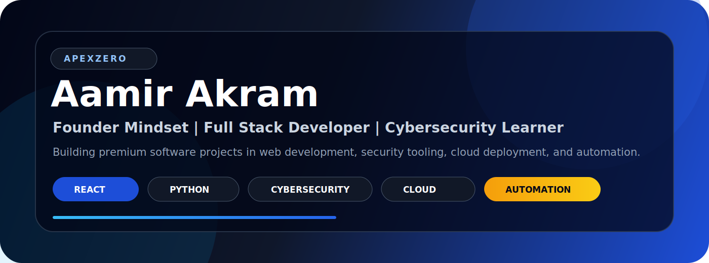



  

<h1 align="center">Aamir Akram</h1>

  <b>Founder Mindset | Full Stack Developer | Cybersecurity Learner | Cloud & Trading Automation</b>

  
  

---

## Executive Profile

I build clean, practical, and professional software projects using React, Python, backend APIs, cybersecurity tools, cloud deployment, and automation workflows.

My focus is building a strong premium developer brand through real-world projects that are useful, documented, and ready to show to clients, recruiters, and collaborators.

---

## ApexZero Focus

- Premium web applications
- Cybersecurity learning tools
- Python backend APIs
- OSINT and automation projects
- Cloud deployment workflows
- Trading automation systems

---

## Technology Stack

  
  
  
  
  
  
  

---

## Flagship Projects

**AI Vulnerability Scanner**  
AI-powered ethical web security scanner for cybersecurity learning and professional portfolio presentation.

**Git OSINT Scanner**  
GitHub OSINT tool for analyzing public repositories, developer activity, and open-source intelligence signals.

**AWS Portfolio**  
Modern cloud portfolio built with React and Vite, deployed using AWS Amplify.

**XAUCore Backend**  
Python backend API foundation for trading automation workflows and dashboard integration.

**XAUCore Privacy**  
Privacy policy page for the XAUCore trading automation platform.

---

## Current Mission

- Build production-ready React and Python projects
- Improve cybersecurity and OSINT tooling
- Strengthen Python fundamentals and problem-solving skills
- Deploy clean projects with proper README files, screenshots, and live demos
- Keep GitHub profile focused, premium, and recruiter-ready

---

## Professional Links

- Portfolio: https://root-aamir.github.io/root-aamir.vercel.app/
- GitHub: https://github.com/Root-Aamir

---

  <b>Clean code. Real projects. Premium execution.</b>

