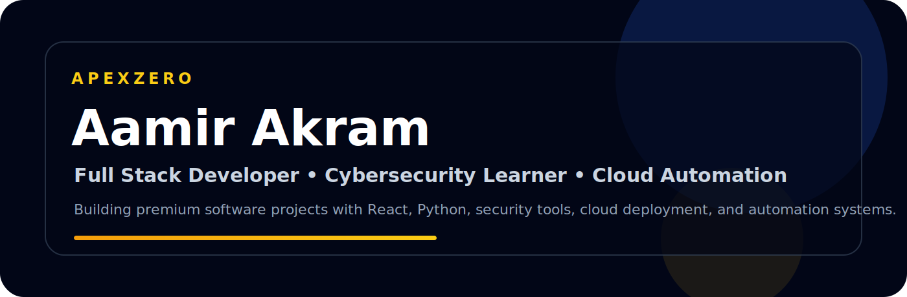



 

# Aamir Akram

### Full Stack Developer • Cybersecurity Learner • AI Automation Builder

Building secure web platforms, automation tools, trading systems, and digital products under **ApexZero**.

 

---

## What I am building

I focus on practical, clean and scalable projects in **software engineering, cybersecurity, automation, trading systems, and premium web platforms**.

| Project | Focus |
|---|---|
| **ApexZero** | Software, cybersecurity, automation and digital products |
| **AI Vulnerability Scanner** | AI-assisted security scanning concept |
| **OSINT Assistant** | Asset and leaked-project detection |
| **Linux Server Utilities** | Server-side tools and automation |
| **TradingView Strategy** | Multi-asset day trading systems |
| **Subdomain Finder** | Reconnaissance and discovery tool |

---

## Tech I work with

  

---

## GitHub Activity

  

---

## Current Focus

- Full-stack web development with **React, Next.js, Tailwind CSS and backend APIs**
- Cybersecurity learning: **OSINT, vulnerability detection and security tools**
- Python automation, AI-assisted workflows and smart dashboards
- Trading technology using **Python, MQL5 and MetaTrader 5**

---

## Connect with me

  
  
  

---

### ApexZero

**Automation • Security • Digital Systems**

