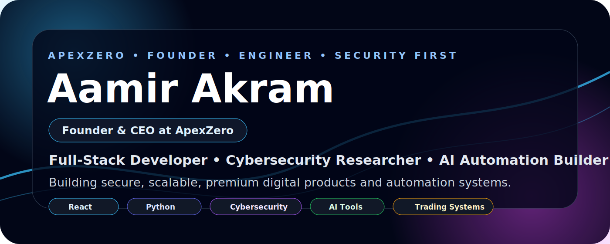
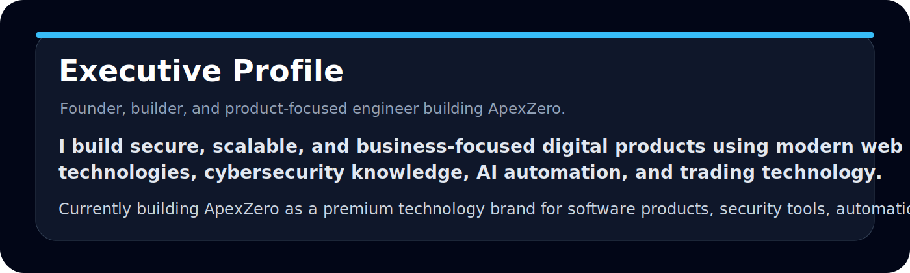
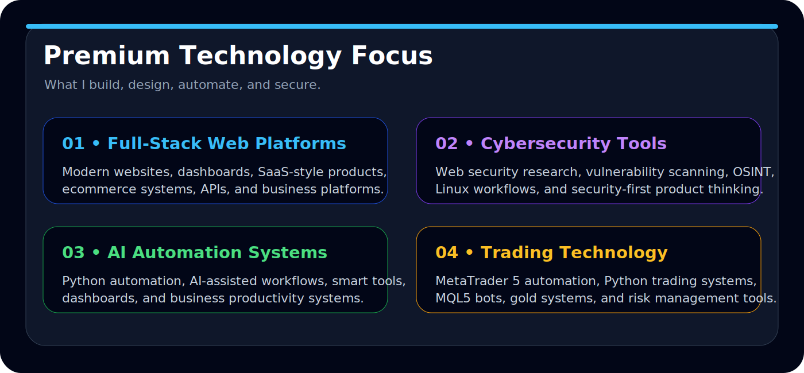
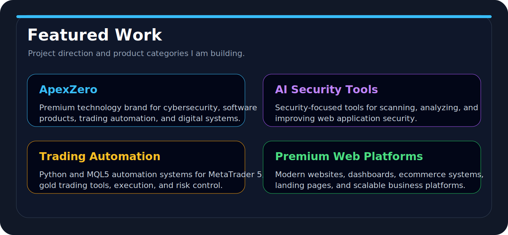
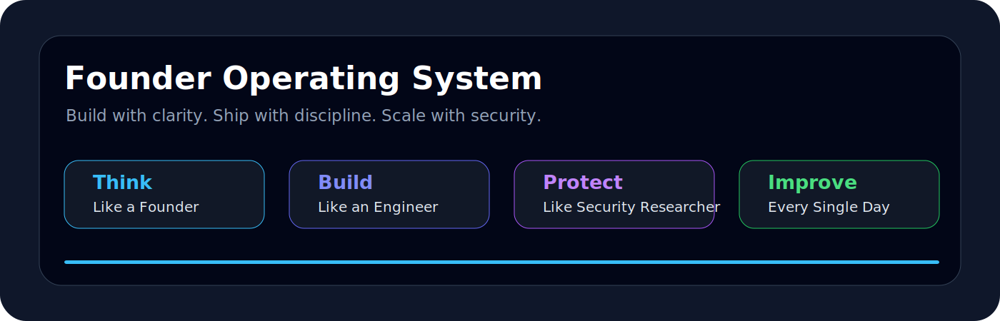
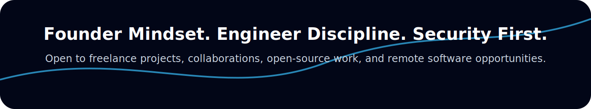

  

<h1 align="center">Aamir Akram</h1>
<h3 align="center">
  Founder &amp; CEO at ApexZero
   
  Full-Stack Developer • Cybersecurity Researcher • AI Automation Builder
</h3>

  
  
  
  

  

  

<h2 align="center">Technology Stack</h2>

  
  
  
  
  
  
  
  
  
  
  
  
  
  

  

  

<h2 align="center">Current Mission</h2>

  My mission is to build production-ready projects across <b>AI automation, cybersecurity tooling, trading technology, full-stack web platforms, and digital business systems</b>.

  Long-term, I am working to grow <b>ApexZero</b> into a trusted technology brand that creates secure, premium, and scalable software products.

<h2 align="center">Connect</h2>

  

  

