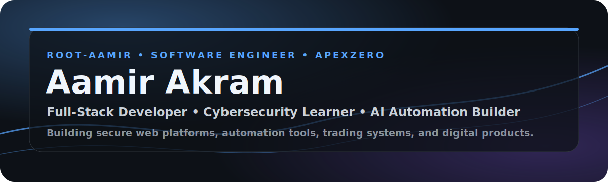

  

<h1 align="center">Aamir Akram</h1>

  <b>Full-Stack Developer • Cybersecurity Learner • AI Automation Builder</b>

  Building secure web platforms, automation tools, trading systems, and digital products under <b>ApexZero</b>.

  
  
  

---
## About Me
I am a software developer focused on building practical, secure, and business-ready digital products.
My work combines full-stack development, cybersecurity learning, AI automation, cloud tools, and trading technology. I am currently building **ApexZero** as a technology brand for software products, security-focused tools, automation systems, and digital business platforms.
---
## What I Work On
### Full-Stack Development
Modern websites, dashboards, landing pages, ecommerce-style platforms, APIs, and business systems using React, Next.js, JavaScript, Tailwind CSS, Node.js, Laravel, and Python.
### Cybersecurity
Web security learning, OSINT workflows, Linux tools, vulnerability scanning, security research, and security-first product thinking.
### AI Automation
Python automation, AI-assisted workflows, smart dashboards, productivity tools, and business automation systems.
### Trading Technology
MetaTrader 5 automation, Python trading systems, MQL5 bots, gold trading tools, and risk-management focused systems.
---
## Tech Stack

  
  
  
  
  
  
  
  
  
  
  
  

---
## Featured Direction
| Area | Focus |
|---|---|
| **ApexZero** | Technology brand for software products, cybersecurity, automation, and digital business systems |
| **AI Security Tools** | Tools for scanning, analyzing, and improving web application security |
| **Trading Automation** | Python and MQL5 systems for MT5, gold trading, execution, and risk control |
| **Premium Web Platforms** | Modern websites, dashboards, ecommerce systems, and landing pages |
---
## Current Mission
My current mission is to build production-ready projects across:
- Full-stack web development
- Cybersecurity tooling
- AI automation
- Trading technology
- Digital business platforms
Long-term, I want to grow **ApexZero** into a trusted technology brand that creates useful, secure, and scalable software products.
---
## GitHub Stats

  
  

---
## Connect

  Open to freelance projects, collaborations, open-source work, product building, and remote software opportunities.

  

---

  <b>Build with clarity. Ship with discipline. Scale with security.</b>

