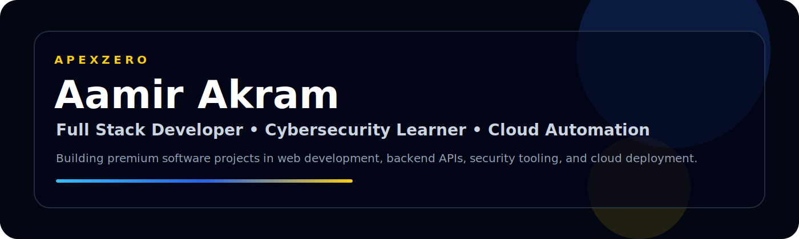
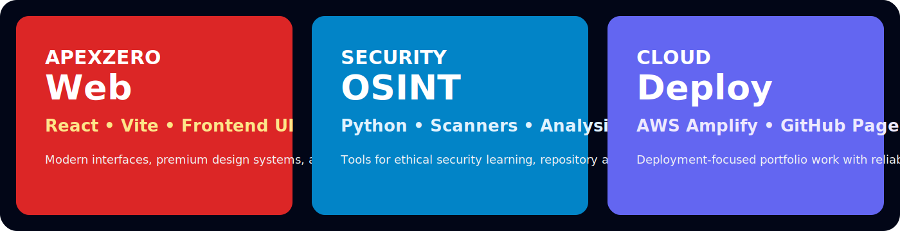

  

<h1 align="center">Aamir Akram</h1>

  <b>Founder Mindset • Full Stack Developer • Cybersecurity Learner • Cloud & Trading Automation</b>

  
  

 

  

<h2>What I am building right now</h2>

I am focused on building practical and professional projects across full stack development, backend APIs, cybersecurity learning tools, cloud deployment, and automation systems.

<ul>
  <li>Premium web projects with React and Vite</li>
  <li>Python-based backend and automation tools</li>
  <li>Cybersecurity and OSINT learning projects</li>
  <li>Cloud-ready portfolios and deployment workflows</li>
  <li>GitHub repositories that are clean, documented, and recruiter-ready</li>
</ul>
<h2>Featured Repositories</h2>
<ul>
  <li><a href="https://github.com/Root-Aamir/ai-vulnerability-scanner">AI Vulnerability Scanner</a> — AI-powered ethical web security scanner for learning and portfolio work.</li>
  <li><a href="https://github.com/Root-Aamir/git-osint-scanner">Git OSINT Scanner</a> — GitHub OSINT tool for repository and developer activity analysis.</li>
  <li><a href="https://github.com/Root-Aamir/aamir-aws-portfolio">AWS Portfolio</a> — Modern cloud portfolio built with React, Vite, and AWS Amplify.</li>
  <li><a href="https://github.com/Root-Aamir/xaucore-backend">XAUCore Backend</a> — Python backend API foundation for trading automation workflows.</li>
  <li><a href="https://github.com/Root-Aamir/xaucore-privacy">XAUCore Privacy</a> — Privacy policy page for the XAUCore trading automation platform.</li>
</ul>
<h2>Professional Focus</h2>
<ul>
  <li>Full Stack Development</li>
  <li>React and Vite Frontend Projects</li>
  <li>Python Backend APIs</li>
  <li>Cybersecurity and OSINT Tools</li>
  <li>Cloud Deployment</li>
  <li>Automation Systems</li>
</ul>
<h2>Tech Stack</h2>

  
  
  
  
  
  
  

<h2>Links</h2>
<ul>
  <li>Portfolio: <a href="https://root-aamir.github.io/root-aamir.vercel.app/">root-aamir.github.io/root-aamir.vercel.app</a></li>
  <li>GitHub: <a href="https://github.com/Root-Aamir">github.com/Root-Aamir</a></li>
</ul>

  <b>Clean code. Real projects. Premium execution.</b>

