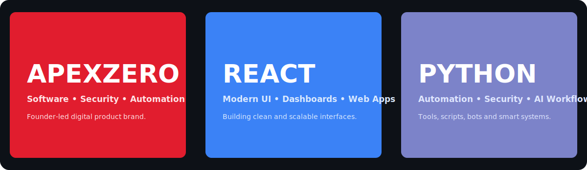

  

<h1 align="center">Aamir Akram</h1>

  <b>Full-Stack Developer • Cybersecurity Learner • AI Automation Builder</b>

  Building secure web platforms, automation tools, trading systems, and digital products under <b>ApexZero</b>.

 
<h2>What have I been up to recently?</h2>

I am focused on building practical software projects, cybersecurity tools, automation systems, and premium web platforms.

<ul>
  <li><a href="https://apexzero.tech/">ApexZero</a> — software, cybersecurity, automation, and digital product brand</li>
  <li><a href="https://github.com/Root-Aamir/ai-vulnerability-scanner">AI Vulnerability Scanner</a> — AI-assisted security scanning concept</li>
  <li><a href="https://github.com/Root-Aamir/omni-sentinel">Omni Sentinel</a> — security-focused project direction</li>
  <li><a href="https://github.com/Root-Aamir/aamir-aws-portfolio">aamir-aws-portfolio</a> — aamir-aws-portfolio</li>
  <li><a href="https://github.com/Root-Aamir/web-security-scanner">Web Security Scanner</a> — web security tooling</li>
  <li><a href="https://github.com/Root-Aamir/subdomain-finder">Subdomain Finder</a> — reconnaissance and discovery tool</li>
</ul>
 
<h2>Tech I work with</h2>

  
  
  
  
  
  
  
  
  
  
  
  

 
<h2>GitHub Activity</h2>

  

 
<h2>Current Focus</h2>
<ul>
  <li>Full-stack web development with React, Next.js, Tailwind CSS and backend APIs</li>
  <li>Cybersecurity learning, OSINT workflows and web security tools</li>
  <li>Python automation, AI-assisted workflows and smart dashboards</li>
  <li>Trading technology using Python, MQL5 and MetaTrader 5</li>
</ul>
 
<h2>Links</h2>
<ul>
  <li>Repositories: <a href="https://github.com/Root-Aamir?tab=repositories">View all repositories</a></li>
  <li>ApexZero: <a href="https://apexzero.tech/">ApexZero</a></li>
</ul>
 

  <b>Aamir Akram — Full-Stack Developer | Cybersecurity | AI Automation</b>

<!-- profile achievement update -->

<!-- pull shark second update -->

<!-- YOLO final try: merged without review -->

<!-- no bot YOLO try -->
