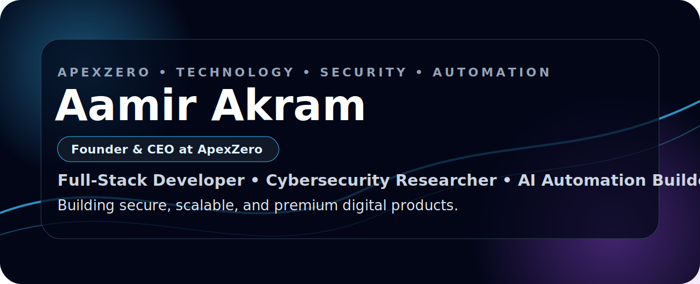

  

<h1 align="center">Aamir Akram</h1>
<h3 align="center">
  Founder &amp; CEO at ApexZero
   
  Full-Stack Developer • Cybersecurity Researcher • AI Automation Builder
</h3>

  
  
  

 
<h2>About Me</h2>

I build secure, scalable, and business-focused digital products using modern web technologies, cybersecurity knowledge, AI automation, and trading technology.

Currently, I am building <b>ApexZero</b> as a premium technology brand focused on software products, cybersecurity systems, AI-powered automation, trading technology, and scalable digital platforms.

 
<h2>What I Build</h2>
<h3>Full-Stack Web Platforms</h3>

Modern websites, dashboards, ecommerce systems, SaaS-style products, API-based applications, and business platforms.

<h3>Cybersecurity Tools</h3>

Security-focused tools for web security research, vulnerability scanning, OSINT workflows, Linux-based testing, and security-first product design.

<h3>AI Automation Systems</h3>

Python automation, AI-assisted workflows, smart dashboards, productivity systems, and business automation tools.

<h3>Trading Technology</h3>

MetaTrader 5 automation, Python trading systems, MQL5 bots, gold trading tools, and risk management systems.

 
<h2>Technology Stack</h2>

  
  
  
  
  
  
  
  
  
  
  
  

 
<h2>Featured Work</h2>
<h3>ApexZero</h3>

A premium technology brand focused on cybersecurity, software products, trading automation, and digital business systems.

<h3>AI Security Tools</h3>

Security-focused tools for scanning, analyzing, and improving web application security.

<h3>Trading Automation Systems</h3>

Python and MQL5-based automation systems for MetaTrader 5 with focus on execution, risk control, and gold trading strategies.

<h3>Premium Web Platforms</h3>

Modern websites, dashboards, ecommerce systems, landing pages, and business platforms built with clean UI and scalable architecture.

 
<h2>Founder Philosophy</h2>

<b>Build with clarity. Ship with discipline. Scale with security.</b>

My approach is simple:

<ul>
  <li>Think like a founder</li>
  <li>Build like an engineer</li>
  <li>Protect like a security researcher</li>
  <li>Improve every day</li>
</ul>
 
<h2>Current Mission</h2>

My mission is to build production-ready projects across <b>AI automation, cybersecurity tooling, trading technology, full-stack web platforms, and digital business systems</b>.

Long-term, I am working to grow <b>ApexZero</b> into a trusted technology brand that creates secure, premium, and scalable software products.

 
<h2>Connect</h2>

  Open to freelance projects, collaborations, open-source work, product building, and remote software opportunities.

  

 

  <b>Founder Mindset. Engineer Discipline. Security First.</b>

