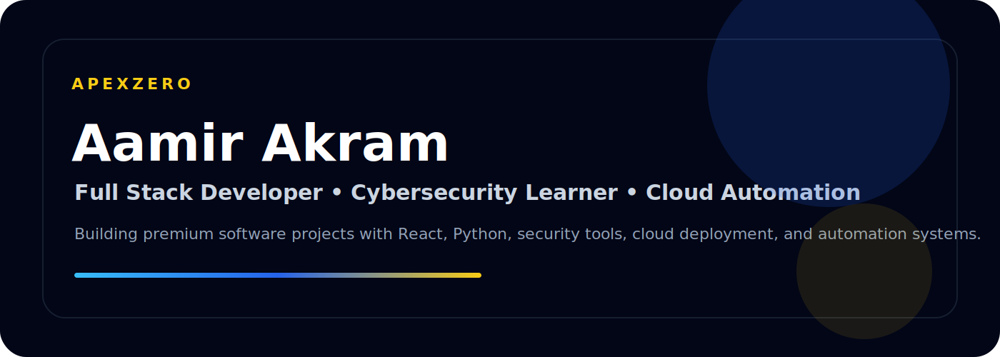



  

<h1 align="center">Aamir Akram</h1>

  <b>Founder Mindset • Full Stack Developer • Cybersecurity Learner • Cloud & Trading Automation</b>

  
  

---
## About
I build practical and professional software projects with a focus on clean execution, real-world use, and strong presentation.
My work combines full stack development, Python backend systems, cybersecurity learning tools, cloud deployment, and automation workflows.
---
## What I Build
- Premium web applications
- Python backend APIs
- Cybersecurity and OSINT tools
- Cloud-deployed portfolios
- Trading automation systems
- Clean GitHub portfolio projects
---
## Tech Stack

  
  
  
  
  
  
  

---
## Selected Projects
**AI Vulnerability Scanner**  
AI-powered ethical web security scanner for cybersecurity learning and portfolio presentation.
**Git OSINT Scanner**  
GitHub OSINT tool for analyzing public repositories and developer activity.
**AWS Portfolio**  
Modern React and Vite portfolio deployed with AWS Amplify.
**XAUCore Backend**  
Python backend API foundation for trading automation workflows.
---
## Current Focus
- Building production-ready React and Python projects
- Improving cybersecurity and OSINT tooling
- Strengthening Python fundamentals and problem solving
- Creating clean, documented, recruiter-ready repositories
---

  <b>Clean code. Real projects. Premium execution.</b>

